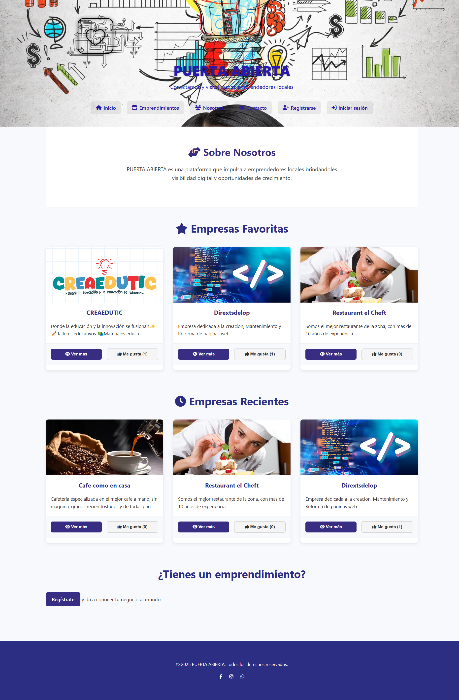
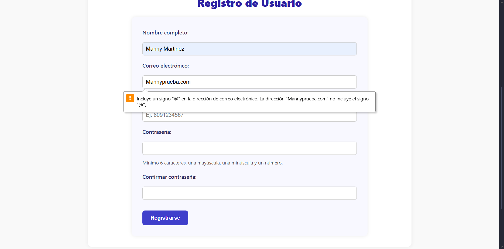
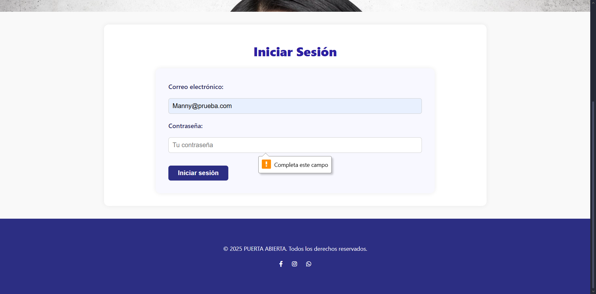
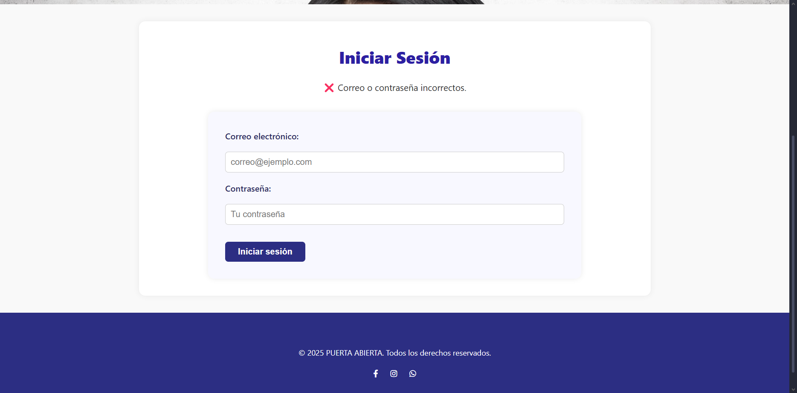
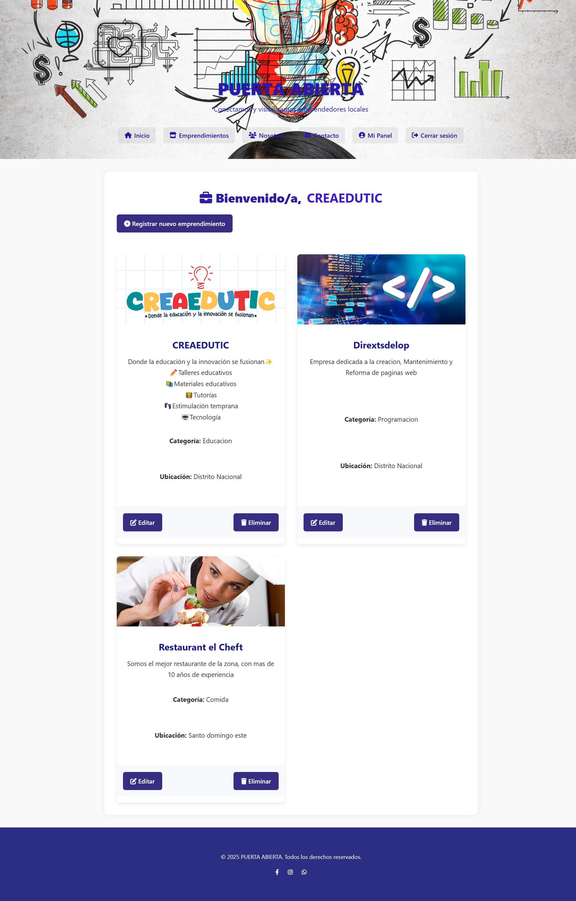
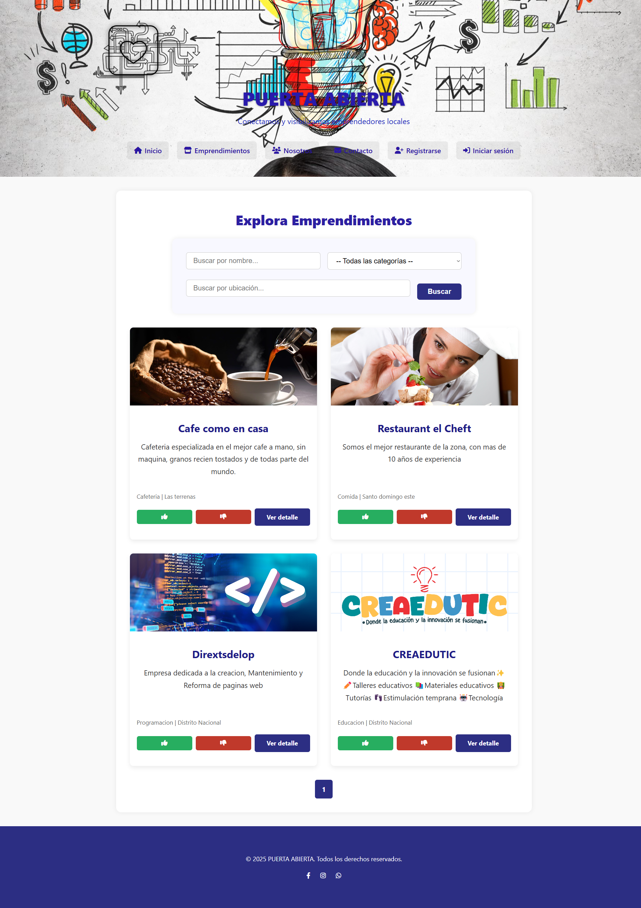
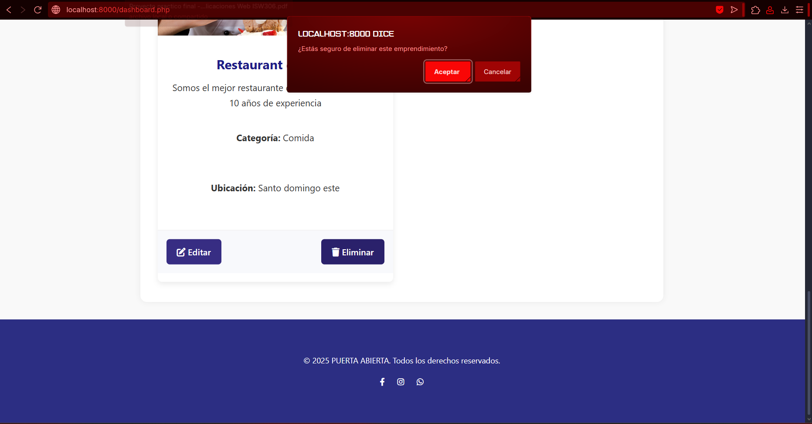
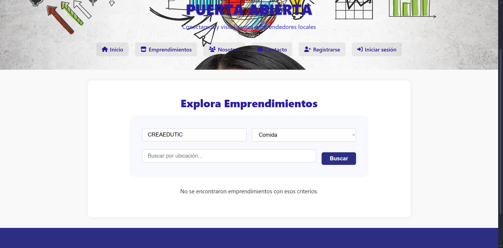

# Puerta Abierta

## Descripción del proyecto

**Puerta Abierta** es una plataforma web desarrollada para apoyar a emprendedores y pequeños negocios en la promoción de sus productos y servicios de una manera sencilla, accesible e interactiva.

La plataforma permite que los usuarios se registren, inicien sesión y publiquen información relacionada con sus emprendimientos. Cada negocio puede incluir su nombre, descripción, categoría, ubicación, imágenes y otros datos importantes para facilitar su promoción dentro de la página.

Los visitantes pueden explorar los emprendimientos registrados, consultar la información detallada de cada negocio, realizar búsquedas y reaccionar mediante las opciones de **“Me gusta”** y **“No me gusta”**.

El proyecto fue desarrollado de manera individual como trabajo final de la asignatura **Gestión de Proyectos Informáticos**, aplicando principios y prácticas de **PMBOK, Scrum y Agile**.

---

## Objetivo general

Desarrollar una plataforma web que facilite la promoción, visibilidad e interacción de emprendedores y pequeños negocios mediante perfiles comerciales, publicaciones y herramientas digitales de participación.

---

## Objetivos específicos

- Permitir el registro de nuevos usuarios.
- Implementar un sistema de inicio y cierre de sesión.
- Facilitar la creación y publicación de emprendimientos.
- Permitir la edición y eliminación de los negocios registrados.
- Mostrar información detallada de cada emprendimiento.
- Organizar los emprendimientos mediante categorías y zonas.
- Permitir la búsqueda de negocios por nombre, categoría y ubicación.
- Incorporar opciones de interacción mediante “Me gusta” y “No me gusta”.
- Ofrecer una interfaz clara, sencilla y fácil de utilizar.
- Almacenar la información mediante una base de datos MySQL.
- Promover la visibilidad digital de pequeños negocios y proyectos emergentes.
- Utilizar Git y GitHub para el control de versiones del proyecto.

---

## Funcionalidades principales

La versión actual de Puerta Abierta incluye las siguientes funciones:

- Registro de usuarios.
- Validación de datos durante el registro.
- Inicio de sesión.
- Validación de contraseña.
- Cierre de sesión.
- Panel principal del usuario.
- Creación de nuevos emprendimientos.
- Edición de emprendimientos.
- Eliminación de emprendimientos.
- Visualización del catálogo de negocios.
- Vista detallada de cada emprendimiento.
- Búsqueda por nombre.
- Búsqueda por categoría.
- Búsqueda por zona.
- Sistema de “Me gusta”.
- Sistema de “No me gusta”.
- Página informativa “Nosotros”.
- Página de contacto.
- Conexión con una base de datos MySQL.
- Administración de los datos mediante phpMyAdmin.

---

## Metodologías aplicadas

### PMBOK

Se aplicaron buenas prácticas de PMBOK para organizar el alcance, el cronograma, los recursos, los riesgos, la comunicación y el seguimiento del proyecto.

### Scrum

El desarrollo se dividió en pequeñas etapas de trabajo para construir progresivamente las funciones principales de la plataforma.

Aunque el proyecto fue realizado por una sola persona, se organizaron las actividades mediante tareas priorizadas y periodos de desarrollo similares a los Sprints.

### Agile

Se utilizó un enfoque flexible que permitió revisar el funcionamiento del sistema, realizar correcciones y adaptar las actividades según las necesidades identificadas durante el desarrollo.

---

## Tecnologías utilizadas

### Lenguajes y tecnologías de desarrollo

- HTML5.
- CSS3.
- JavaScript.
- PHP.
- SQL.

### Base de datos

- MySQL.
- phpMyAdmin.

### Entorno de desarrollo

- Visual Studio Code.
- XAMPP.
- Apache.

### Gestión, documentación y comunicación

- Git.
- GitHub.
- Trello.
- Microsoft Word.
- Microsoft Excel.
- Canva.
- Google Drive.
- YouTube.

---

## Estructura del proyecto

```text
puerta_abierta/
│
├── Capturas/
│   ├── busqueda_categoria.png
│   ├── Busqueda_nombre.png
│   ├── busqueda_zona.png
│   ├── Crear.png
│   ├── dashboard.png
│   ├── Eliminar.png
│   ├── emprendimiento.png
│   ├── emprendimiento_Editar.png
│   ├── Index.png
│   ├── registro.png
│   ├── registro_correoreg.png
│   ├── sesion.png
│   └── sesion_contrase.png
│
├── css/
│   └── Archivos de estilos de la plataforma
│
├── includes/
│   └── Conexión con la base de datos y archivos reutilizables
│
├── js/
│   └── Archivos JavaScript
│
├── contacto.php
├── dashboard.php
├── dislike.php
├── editar_emprendimiento.php
├── eliminar_emprendimiento.php
├── emprendimientos.php
├── index.php
├── like.php
├── login.php
├── logout.php
├── nosotros.php
├── nuevo_emprendimiento.php
├── registro.php
├── ver_detalle.php
├── .gitignore
└── README.md
```

También se recomienda incluir una carpeta para almacenar la base de datos:

```text
database/
└── puerta_abierta.sql
```

---

## Descripción de los archivos principales

| Archivo | Descripción |
|---|---|
| `index.php` | Página principal de Puerta Abierta. |
| `registro.php` | Permite registrar nuevos usuarios. |
| `login.php` | Permite que los usuarios inicien sesión. |
| `logout.php` | Finaliza la sesión activa del usuario. |
| `dashboard.php` | Muestra el panel principal del usuario registrado. |
| `nuevo_emprendimiento.php` | Permite publicar un nuevo emprendimiento. |
| `editar_emprendimiento.php` | Permite modificar los datos de un emprendimiento. |
| `eliminar_emprendimiento.php` | Permite eliminar un emprendimiento registrado. |
| `emprendimientos.php` | Muestra el catálogo de negocios publicados. |
| `ver_detalle.php` | Presenta la información completa de un emprendimiento. |
| `like.php` | Procesa las reacciones positivas. |
| `dislike.php` | Procesa las reacciones negativas. |
| `nosotros.php` | Presenta información sobre el propósito de la plataforma. |
| `contacto.php` | Contiene la sección de contacto. |
| `includes/` | Contiene la conexión y otros componentes reutilizables. |
| `css/` | Contiene los estilos visuales de la plataforma. |
| `js/` | Contiene las funciones de interactividad. |
| `Capturas/` | Contiene las evidencias visuales del funcionamiento. |
| `.gitignore` | Indica los archivos que Git no debe subir al repositorio. |
| `README.md` | Contiene la documentación general del proyecto. |

---

## Requisitos para ejecutar el proyecto

Para ejecutar Puerta Abierta se necesita:

- Sistema operativo Windows.
- XAMPP instalado.
- Apache activo.
- MySQL activo.
- Navegador web.
- Acceso a phpMyAdmin.
- Visual Studio Code u otro editor de código.
- Git, en caso de clonar el repositorio.

---

## Instalación y ejecución

### 1. Descargar o clonar el repositorio

El proyecto puede descargarse como archivo ZIP desde GitHub.

También puede clonarse mediante Git:

```bash
git clone URL_DEL_REPOSITORIO
```

Se debe sustituir `URL_DEL_REPOSITORIO` por el enlace real del repositorio.

---

### 2. Copiar el proyecto dentro de XAMPP

La carpeta del proyecto debe colocarse dentro de:

```text
C:\xampp\htdocs\
```

La ubicación utilizada durante el desarrollo fue:

```text
C:\xampp\htdocs\Trabajo Final\puerta_abierta
```

---

### 3. Iniciar los servicios de XAMPP

Abrir el panel de control de XAMPP e iniciar:

- Apache.
- MySQL.

Ambos servicios deben aparecer activos antes de abrir la plataforma.

---

### 4. Abrir phpMyAdmin

Desde el navegador se debe acceder a:

```text
http://localhost/phpmyadmin
```

También puede abrirse mediante el botón **Admin** ubicado al lado de MySQL en el panel de XAMPP.

---

### 5. Crear la base de datos

En phpMyAdmin se debe crear una base de datos con el nombre:

```text
puerta_abierta
```

---

### 6. Importar la base de datos

Después de seleccionar la base de datos `puerta_abierta`:

1. Entrar en la pestaña **Importar**.
2. Seleccionar el archivo SQL.
3. Pulsar **Continuar**.

El archivo debe estar ubicado preferiblemente en:

```text
database/puerta_abierta.sql
```

Este archivo debe contener las tablas necesarias para ejecutar el sistema.

---

### 7. Configurar la conexión

La configuración básica utilizada con XAMPP es:

```php
<?php

$servidor = "localhost";
$usuario = "root";
$contrasena = "";
$base_datos = "puerta_abierta";
```

El archivo de conexión se encuentra dentro de la carpeta:

```text
includes/
```

Los nombres de las variables pueden variar de acuerdo con la implementación del proyecto.

---

### 8. Abrir el proyecto

Como la carpeta se encuentra dentro de `Trabajo Final`, la dirección utilizada es:

```text
http://localhost/Trabajo%20Final/puerta_abierta/
```

También puede abrirse mediante:

```text
http://localhost/Trabajo%20Final/puerta_abierta/index.php
```

Si la carpeta `puerta_abierta` se coloca directamente dentro de `htdocs`, la dirección será:

```text
http://localhost/puerta_abierta/
```

---

## Uso de la plataforma

Para utilizar Puerta Abierta se deben seguir estos pasos:

1. Abrir la página principal.
2. Seleccionar la opción de registro.
3. Completar los datos solicitados.
4. Crear la cuenta.
5. Iniciar sesión.
6. Acceder al panel del usuario.
7. Seleccionar la opción para crear un emprendimiento.
8. Completar la información del negocio.
9. Guardar la publicación.
10. Visualizar el emprendimiento en el catálogo.
11. Consultar sus detalles.
12. Buscar negocios por nombre, categoría o zona.
13. Editar o eliminar una publicación cuando sea necesario.
14. Interactuar mediante las opciones de “Me gusta” y “No me gusta”.
15. Cerrar la sesión al terminar.

---

## Base de datos

La base de datos almacena información relacionada con:

- Usuarios registrados.
- Credenciales de acceso.
- Emprendimientos.
- Nombres y descripciones de los negocios.
- Categorías.
- Zonas o ubicaciones.
- Información de contacto.
- Imágenes.
- Reacciones positivas.
- Reacciones negativas.

La estructura exacta de las tablas puede variar según la implementación desarrollada.

---

## Archivo `.gitignore`

El repositorio incluye un archivo `.gitignore` para evitar que se publiquen archivos temporales, configuraciones innecesarias o información privada.

Contenido recomendado:

```gitignore
# Variables privadas
.env

# Archivos temporales
*.log
*.tmp
*.bak
*.cache

# Archivos de Windows
Thumbs.db
desktop.ini

# Archivos de macOS
.DS_Store

# Configuraciones de editores
.vscode/
.idea/

# Dependencias
vendor/
node_modules/

# Archivos comprimidos
*.zip
*.rar
```

No se deben publicar contraseñas, tokens, claves privadas ni información personal sensible dentro del repositorio.

---

## Control de versiones

El proyecto utilizó Git y GitHub para registrar los cambios realizados durante su desarrollo.

Git permitió:

- Crear un repositorio local.
- Registrar las modificaciones realizadas.
- Mantener un historial de versiones.
- Recuperar versiones anteriores.
- Conservar copias del código fuente.
- Subir el proyecto a GitHub.
- Evidenciar el progreso del desarrollo.

Ejemplos de mensajes utilizados en los commits:

```text
Creación inicial del proyecto Puerta Abierta
```

```text
Diseño de la página principal
```

```text
Implementación del registro de usuarios
```

```text
Desarrollo del inicio de sesión
```

```text
Creación del panel de usuario
```

```text
Implementación del módulo de emprendimientos
```

```text
Desarrollo de la edición y eliminación de negocios
```

```text
Implementación del sistema de likes y dislikes
```

```text
Implementación de búsquedas por nombre, categoría y zona
```

```text
Corrección de la conexión con MySQL
```

```text
Agregadas capturas y evidencias funcionales
```

```text
Actualización del archivo README
```

```text
Corrección de errores y versión final
```

---

## Comandos utilizados en Git

### Inicializar el repositorio

```bash
git init
```

### Establecer la rama principal

```bash
git branch -M main
```

### Revisar el estado de los archivos

```bash
git status
```

### Agregar los archivos

```bash
git add .
```

### Crear un commit

```bash
git commit -m "Creación inicial del proyecto Puerta Abierta"
```

### Conectar el repositorio con GitHub

```bash
git remote add origin URL_DEL_REPOSITORIO
```

### Subir el proyecto

```bash
git push -u origin main
```

### Subir futuras modificaciones

```bash
git add .
git commit -m "Descripción del cambio realizado"
git push
```

---

# Capturas de pantalla

## Página principal

La página principal presenta la identidad de Puerta Abierta y las principales opciones de navegación.



---

## Registro de usuarios

Formulario utilizado para crear una nueva cuenta dentro de la plataforma.



---

## Validación del correo durante el registro

Evidencia de la validación realizada al introducir el correo electrónico en el formulario de registro.


---

## Inicio de sesión

Formulario utilizado para que los usuarios registrados puedan acceder a la plataforma.



---

## Validación de la contraseña

Evidencia de la validación realizada durante el inicio de sesión.



---

## Panel principal del usuario

El panel permite al usuario visualizar y administrar sus emprendimientos.



---

## Catálogo de emprendimientos

Pantalla en la que se muestran los emprendimientos publicados dentro de la plataforma.



---

## Creación de un emprendimiento

Formulario utilizado para registrar un nuevo emprendimiento dentro de la plataforma.


---

## Edición de un emprendimiento

Pantalla utilizada para modificar la información de un emprendimiento existente.


---

## Eliminación de un emprendimiento

Evidencia del proceso utilizado para eliminar un negocio registrado.



---

## Búsqueda por nombre

La plataforma permite localizar emprendimientos utilizando el nombre del negocio.


---

## Búsqueda por categoría

Los usuarios pueden filtrar los emprendimientos según la categoría a la que pertenecen.



---

## Búsqueda por zona

La plataforma permite localizar negocios según su zona o ubicación.


--------------------------------------
## Evidencia funcional

Durante las pruebas del sistema se verificó que:

- Apache ejecutara correctamente la plataforma.
- MySQL se conectara con el proyecto.
- Los usuarios pudieran registrarse.
- Los datos del registro fueran validados.
- Los usuarios pudieran iniciar sesión.
- Las contraseñas fueran verificadas.
- Las sesiones pudieran cerrarse.
- Los emprendimientos pudieran publicarse.
- Los negocios pudieran editarse.
- Los emprendimientos pudieran eliminarse.
- La información se almacenara en la base de datos.
- Los negocios aparecieran en el catálogo.
- La información detallada se mostrara correctamente.
- Las búsquedas por nombre funcionaran.
- Las búsquedas por categoría funcionaran.
- Las búsquedas por zona funcionaran.
- Las reacciones positivas y negativas se registraran.
- La plataforma pudiera abrirse mediante XAMPP y Apache.

---

## Video de demostración

En el siguiente video se presenta la explicación y demostración funcional del proyecto Puerta Abierta:

[Ver video de demostración de Puerta Abierta](https://youtu.be/KLl5fb7L4MU)

Enlace directo:

```text
https://youtu.be/KLl5fb7L4MU
```

---

## Seguridad

Durante el desarrollo se tomaron en cuenta recomendaciones básicas de seguridad:

- Validación de los datos enviados mediante formularios.
- Control del inicio y cierre de sesión.
- Restricción del acceso a páginas privadas.
- Protección de la conexión con la base de datos.
- Verificación de los datos antes de almacenarlos.
- Uso recomendado de consultas preparadas.
- Uso recomendado de `password_hash()` para proteger las contraseñas.
- Uso de `.gitignore` para evitar la publicación de información privada.
- Realización de copias de seguridad del código y la base de datos.

---

## Mejoras futuras

En futuras versiones se podrán incorporar:

- Sistema de comentarios.
- Opciones para compartir en redes sociales.
- Buscador avanzado.
- Filtros adicionales.
- Planes de suscripción.
- Publicaciones destacadas.
- Espacios publicitarios.
- Panel administrativo.
- Estadísticas de visitas.
- Mensajería interna.
- Sistema de notificaciones.
- Recuperación de contraseña.
- Verificación de emprendimientos.
- Geolocalización.
- Aplicación móvil.
- Integración con pasarelas de pago.
- Recomendaciones mediante inteligencia artificial.

---

## Resultados alcanzados

El desarrollo de Puerta Abierta permitió:

- Crear una plataforma web funcional.
- Integrar PHP con MySQL.
- Administrar información mediante phpMyAdmin.
- Implementar el registro y acceso de usuarios.
- Crear un sistema de publicación de emprendimientos.
- Permitir la edición y eliminación de negocios.
- Incorporar búsquedas por nombre, categoría y zona.
- Implementar reacciones de los usuarios.
- Aplicar herramientas de gestión de proyectos.
- Utilizar GitHub como sistema de control de versiones.
- Documentar el proceso de instalación y ejecución.
- Presentar evidencias visuales y funcionales del sistema.

---

## Autoría

Proyecto desarrollado individualmente por:

**Desarrollador:** Manny Martinez  
**Proyecto:** Puerta Abierta  
**Asignatura:** Gestión de Proyectos Informáticos  
**Periodo académico:** Mayo-julio de 2026  

---

## Repositorio de GitHub

Enlace del repositorio:

```text
(https://github.com/Direxts/Puerta_abierta.git)
```

---

## Licencia

Este proyecto fue desarrollado con fines académicos y educativos.

El código puede utilizarse como referencia para actividades de aprendizaje, siempre que se reconozca la autoría correspondiente.
